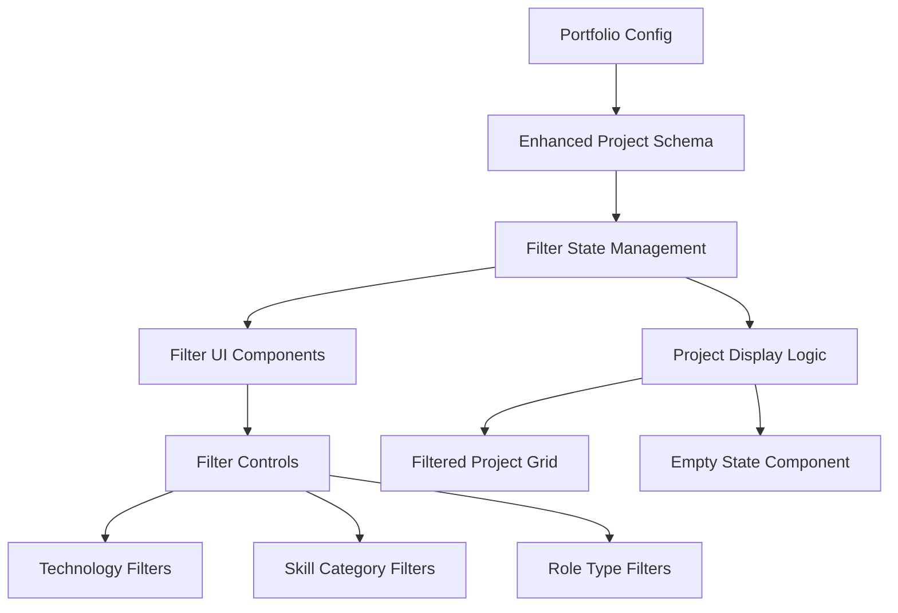
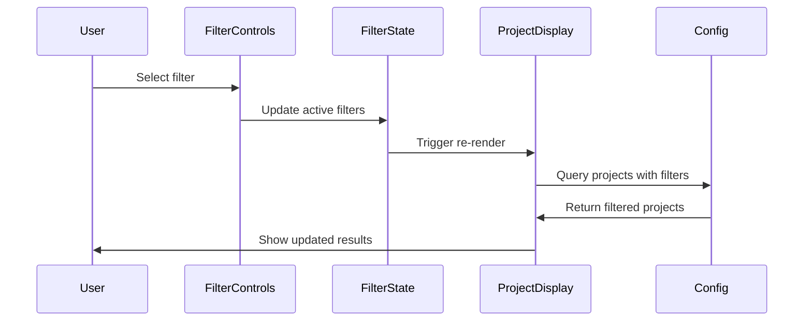

# Design Document

## Overview

The project filtering system will transform the current simple role-based project categorization into a sophisticated multi-dimensional filtering interface. This system will allow portfolio visitors to discover projects through various lenses including technologies, skills, project types, and domains while maintaining the existing clean design aesthetic.

The design extends the current portfolio configuration system by enriching project metadata and adding client-side filtering capabilities with real-time updates and mobile-responsive controls.

## Architecture

### High-Level Architecture



### Data Flow



## Components and Interfaces

### Enhanced Project Schema

The current project schema will be extended to support multi-dimensional categorization:

```typescript
// Extended project schema
export const enhancedProjectSchema = z.object({
  // Existing fields remain unchanged
  id: z.number().int().min(1),
  slug: z.string().min(1),
  title: z.string().min(1),
  summary: z.string().min(1),
  highlights: z.array(z.string().min(1)).min(1),
  tech: z.array(z.string().min(1)).min(1), // Existing tech array - now filterable
  links: projectLinksSchema,
  metrics: z.array(projectMetricSchema).optional(),
  thumbnail: z.string().min(1),
  isFeatured: z.boolean().optional(),
  
  // Enhanced categorization fields
  roles: z.array(z.string().min(1)).min(1), // Multiple roles instead of single role
  skillCategories: z.array(z.string().min(1)).min(1), // New skill categories
  domains: z.array(z.string().min(1)).optional(), // Optional domain categories
  
  // Backward compatibility
  role: z.string().min(1), // Deprecated but maintained for compatibility
})
```

### Filter State Interface

```typescript
interface FilterState {
  technologies: string[] // Filter by tech stack used
  roles: string[]
  skillCategories: string[]
  domains: string[]
  searchQuery: string
  filterMode: 'AND' | 'OR' // For technology filtering
}

interface FilterActions {
  toggleTechnology: (tech: string) => void
  toggleRole: (role: string) => void
  toggleSkillCategory: (category: string) => void
  toggleDomain: (domain: string) => void
  setSearchQuery: (query: string) => void
  setFilterMode: (mode: 'AND' | 'OR') => void
  clearAllFilters: () => void
  clearFilterCategory: (category: keyof FilterState) => void
}
```

### Component Architecture

#### FilterProvider Component
- Manages global filter state using React Context
- Provides filter actions to child components
- Handles URL synchronization for shareable filtered views
- Persists filter preferences in localStorage

#### FilterControls Component
- Renders filter UI with collapsible sections
- Supports mobile-responsive design with drawer/modal patterns
- Shows active filter count and clear options
- Implements search functionality

#### FilteredProjectsDisplay Component
- Consumes filter state and applies filtering logic
- Renders filtered project grid with smooth transitions
- Shows result count and empty states
- Maintains existing featured/other project distinction

#### FilterChip Component
- Displays active filters as removable chips
- Shows filter category and value
- Provides individual filter removal

## Data Models

### Predefined Categories

The system will use predefined categories to ensure consistency and enable effective filtering:

```typescript
// Technologies - Predefined list for consistency and SEO
export const TECHNOLOGIES = [
  // Frontend Frameworks & Libraries
  'React',
  'Next.js',
  'Vue.js',
  'Angular',
  'Svelte',
  'TypeScript',
  'JavaScript',
  'HTML/CSS',
  
  // Styling & UI
  'Tailwind CSS',
  'shadcn/ui',
  'Radix UI',
  'Framer Motion',
  'CSS Modules',
  'Styled Components',
  
  // Backend & APIs
  'Node.js',
  'Express.js',
  'FastAPI',
  'Django',
  'Flask',
  'GraphQL',
  'REST API',
  'tRPC',
  
  // Databases
  'PostgreSQL',
  'MySQL',
  'MongoDB',
  'Redis',
  'Supabase',
  'Firebase',
  'Prisma',
  'Drizzle ORM',
  
  // Cloud & Infrastructure
  'AWS',
  'Vercel',
  'Netlify',
  'Docker',
  'Kubernetes',
  'AWS Amplify',
  'AWS Bedrock',
  'AWS Lambda',
  
  // AI & Machine Learning
  'OpenAI',
  'AI SDK',
  'LangChain',
  'Hugging Face',
  'TensorFlow',
  'PyTorch',
  
  // Mobile Development
  'React Native',
  'Flutter',
  'Swift',
  'Kotlin',
  
  // Game Development
  'Unity',
  'C#',
  'Unreal Engine',
  'Godot',
  
  // DevTools & Testing
  'Git',
  'GitHub',
  'GitHub Actions',
  'Jest',
  'Vitest',
  'Cypress',
  'Playwright',
  'ESLint',
  'Prettier',
  
  // Other Tools
  'Figma',
  'Adobe Creative Suite',
  'Blender',
  'Postman'
] as const

// Skill Categories
export const SKILL_CATEGORIES = [
  'Frontend Development',
  'Backend Development', 
  'Full Stack Development',
  'AI/Machine Learning',
  'DevOps/Infrastructure',
  'Mobile Development',
  'Game Development',
  'UI/UX Design',
  'Data Engineering',
  'API Development'
] as const

// Role Types  
export const ROLE_TYPES = [
  'Frontend',
  'Backend', 
  'Full Stack',
  'AI Engineer',
  'DevOps',
  'Mobile',
  'Game Developer',
  'Designer',
  'Data Engineer',
  'DevTools'
] as const

// Domain Categories
export const DOMAIN_CATEGORIES = [
  'E-commerce',
  'Education',
  'Healthcare',
  'Finance',
  'Entertainment',
  'Productivity',
  'Social',
  'Enterprise',
  'Open Source',
  'Personal'
] as const
```

### Filter Configuration

```typescript
interface FilterConfig {
  categories: {
    technologies: {
      label: string
      items: string[] // Populated from predefined TECHNOLOGIES constant
      multiSelect: boolean
      searchable: boolean
    }
    roles: {
      label: string
      items: string[]
      multiSelect: boolean
      searchable: boolean
    }
    skillCategories: {
      label: string
      items: string[]
      multiSelect: boolean
      searchable: boolean
    }
    domains: {
      label: string
      items: string[]
      multiSelect: boolean
      searchable: boolean
    }
  }
  defaultMode: 'AND' | 'OR'
  enableUrlSync: boolean
  enableLocalStorage: boolean
}
```

## Error Handling

### Filter State Errors
- Invalid filter values are silently ignored
- URL parameter parsing errors fall back to default state
- localStorage corruption is handled gracefully with state reset

### Performance Considerations
- Debounced search input to prevent excessive filtering
- Memoized filter calculations to avoid unnecessary re-renders
- Virtualization for large project lists (future enhancement)

### Accessibility Errors
- Screen reader announcements for filter changes
- Keyboard navigation support for all filter controls
- Focus management when filters are applied/cleared

## Testing Strategy

### Unit Tests
- Filter state management logic
- Project filtering algorithms
- URL synchronization utilities
- Component rendering with various filter states

### Integration Tests
- Filter interaction workflows
- Mobile responsive behavior
- Performance with large project datasets
- Accessibility compliance testing

### Visual Regression Tests
- Filter UI appearance across breakpoints
- Transition animations and loading states
- Empty state designs
- Active filter chip displays

## Implementation Phases

### Phase 1: Core Filtering Infrastructure
- Extend project schema with new categorization fields
- Implement FilterProvider and core state management
- Create basic FilterControls component
- Add filtering logic to project display

### Phase 2: Enhanced UI and UX
- Implement mobile-responsive filter controls
- Add search functionality
- Create filter chips and active state indicators
- Implement smooth transitions and animations

### Phase 3: Advanced Features
- URL synchronization for shareable filtered views
- localStorage persistence for user preferences
- Performance optimizations and debouncing
- Analytics tracking for filter usage

### Phase 4: Polish and Optimization
- Accessibility enhancements
- Visual polish and micro-interactions
- Performance monitoring and optimization
- Comprehensive testing coverage

## Migration Strategy

### Backward Compatibility
- Existing `role` field will be automatically converted to `roles` array
- Current `tech` arrays remain unchanged
- New fields are optional with sensible defaults

### Data Migration
```typescript
// Migration utility for existing projects
function migrateProject(oldProject: Project): EnhancedProject {
  return {
    ...oldProject,
    roles: [oldProject.role], // Convert single role to array
    skillCategories: inferSkillCategories(oldProject.role, oldProject.tech),
    domains: inferDomains(oldProject.summary, oldProject.highlights),
    tech: normalizeTechnologies(oldProject.tech) // Normalize to predefined list
  }
}

// Normalize technologies to match predefined list
function normalizeTechnologies(techArray: string[]): string[] {
  return techArray.map(tech => {
    // Map common variations to standard names
    const techMap: Record<string, string> = {
      'NextJS': 'Next.js',
      'ReactJS': 'React',
      'TailwindCSS': 'Tailwind CSS',
      'shadcn': 'shadcn/ui',
      'OpenAI API': 'OpenAI',
      'AWS Amplify Gen 2': 'AWS Amplify'
      // Add more mappings as needed
    }
    return techMap[tech] || tech
  }).filter(tech => TECHNOLOGIES.includes(tech as any))
}
```

### Rollout Plan
1. Deploy enhanced schema with backward compatibility
2. Gradually migrate existing projects to new format
3. Enable filtering UI with feature flag
4. Full rollout after testing and validation
5. Remove deprecated fields in future version