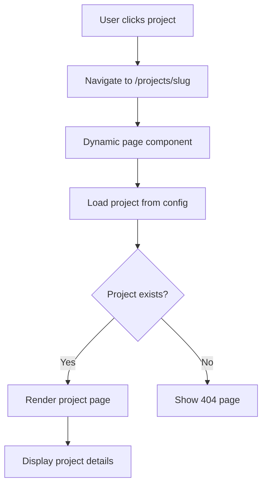

# Design Document

## Overview

The single project page feature will create dedicated pages for each portfolio project, accessible via `/projects/[slug]` routes. This design leverages Next.js 15 App Router with dynamic routing, maintains the existing configuration-driven architecture, and provides an immersive project showcase experience that extends beyond the summary view in the main projects section.

## Architecture

### Routing Structure
```
app/
├── projects/
│   └── [slug]/
│       └── page.tsx          # Dynamic project page
├── layout.tsx                # Root layout (existing)
└── page.tsx                  # Home page (existing)
```

### URL Pattern
- Project pages: `/projects/{project-slug}`
- Example: `/projects/shadcn-interactive-transcript`
- 404 handling for non-existent project slugs

### Data Flow


## Components and Interfaces

### Core Components

#### 1. ProjectPage Component (`app/projects/[slug]/page.tsx`)
```typescript
interface ProjectPageProps {
  params: { slug: string }
}

export default function ProjectPage({ params }: ProjectPageProps)
```

**Responsibilities:**
- Fetch project data by slug from configuration
- Handle 404 cases for non-existent projects
- Render project layout with all sections
- Generate metadata for SEO

#### 2. ProjectHero Component
```typescript
interface ProjectHeroProps {
  project: Project
}
```

**Features:**
- Large hero image/thumbnail
- Project title and role badge
- Quick stats (metrics)
- Action buttons (demo, repo, back to projects)

#### 3. ProjectContent Component
```typescript
interface ProjectContentProps {
  project: Project
}
```

**Sections:**
- Project overview and summary
- Technical highlights
- Technology stack with badges
- Detailed description (extended from config)
- Code examples (if available)
- Challenges and solutions

#### 4. ProjectGallery Component
```typescript
interface ProjectGalleryProps {
  images: string[]
  title: string
}
```

**Features:**
- Image carousel/grid for additional screenshots
- Lightbox functionality for full-size viewing
- Responsive image optimization

#### 5. ProjectNavigation Component
```typescript
interface ProjectNavigationProps {
  currentProject: Project
  allProjects: Project[]
}
```

**Features:**
- Breadcrumb navigation
- Previous/Next project navigation
- Back to projects link

### Enhanced Configuration Schema

Extend the existing project schema to support additional project page content:

```typescript
// Extended project interface for single pages
interface ExtendedProject extends Project {
  // Additional fields for project pages
  fullDescription?: string        // Detailed description beyond summary
  codeExamples?: CodeExample[]    // Code snippets with syntax highlighting
  additionalImages?: string[]     // Gallery images beyond thumbnail
  challenges?: string[]           // Technical challenges faced
  solutions?: string[]            // Solutions implemented
  lessons?: string[]              // Key learnings and takeaways
  timeline?: ProjectTimeline      // Development timeline
  architecture?: string           // Architecture description
}

interface CodeExample {
  title: string
  language: string
  code: string
  description?: string
}

interface ProjectTimeline {
  startDate?: string
  endDate?: string
  duration?: string
  phases?: TimelinePhase[]
}

interface TimelinePhase {
  name: string
  description: string
  duration: string
}
```

## Data Models

### Project Data Enhancement

The existing `portfolioConfig.projects.items` will be enhanced with optional fields for project pages:

```typescript
// Example enhanced project in config
{
  id: 1,
  slug: "shadcn-interactive-transcript",
  title: "Interactive Video Transcript",
  // ... existing fields ...
  
  // New optional fields for project pages
  fullDescription: `This project demonstrates advanced AI integration...`,
  codeExamples: [
    {
      title: "Semantic Search Implementation",
      language: "typescript",
      code: `const searchTranscript = async (query: string) => {
  const embedding = await openai.embeddings.create({
    model: "text-embedding-ada-002",
    input: query
  });
  // ... rest of implementation
};`,
      description: "Core semantic search functionality using OpenAI embeddings"
    }
  ],
  additionalImages: [
    "/project-gallery/transcript-search.png",
    "/project-gallery/transcript-timeline.png"
  ],
  challenges: [
    "Implementing real-time bidirectional sync between video and transcript",
    "Optimizing semantic search performance for large transcripts"
  ],
  solutions: [
    "Used React refs and custom hooks for precise timing synchronization",
    "Implemented vector indexing with Supabase for sub-200ms search responses"
  ],
  timeline: {
    duration: "3 weeks",
    phases: [
      {
        name: "Research & Planning",
        description: "API research and architecture design",
        duration: "1 week"
      },
      {
        name: "Core Development",
        description: "Video player and transcript sync implementation",
        duration: "1.5 weeks"
      },
      {
        name: "AI Integration",
        description: "Semantic search and embeddings integration",
        duration: "0.5 weeks"
      }
    ]
  }
}
```

### Utility Functions

```typescript
// lib/project-utils.ts extensions
export function getProjectBySlug(slug: string): Project | null
export function getAdjacentProjects(currentSlug: string): {
  previous: Project | null
  next: Project | null
}
export function generateProjectMetadata(project: Project): Metadata
```

## Error Handling

### 404 Handling
- Custom 404 page for non-existent project slugs
- Graceful fallback to main projects section
- SEO-friendly 404 responses

### Loading States
- Skeleton loading for project content
- Progressive image loading
- Smooth transitions between sections

### Error Boundaries
- Component-level error boundaries for project sections
- Fallback UI for failed image loads
- Graceful degradation for missing optional content

## Testing Strategy

### Unit Tests
- Project data fetching utilities
- URL slug validation
- Component rendering with mock data
- Navigation logic

### Integration Tests
- End-to-end project page navigation
- Dynamic routing functionality
- SEO metadata generation
- Responsive layout testing

### Performance Tests
- Image loading optimization
- Page load speed metrics
- Core Web Vitals compliance

## SEO and Metadata

### Dynamic Metadata Generation
```typescript
export async function generateMetadata({ params }: ProjectPageProps): Promise<Metadata> {
  const project = getProjectBySlug(params.slug)
  
  if (!project) {
    return {
      title: 'Project Not Found - Rhyan Vargas',
      description: 'The requested project could not be found.'
    }
  }

  return {
    title: `${project.title} - Rhyan Vargas`,
    description: project.summary,
    openGraph: {
      title: project.title,
      description: project.summary,
      images: [project.thumbnail],
      type: 'article'
    },
    twitter: {
      card: 'summary_large_image',
      title: project.title,
      description: project.summary,
      images: [project.thumbnail]
    }
  }
}
```

### Static Generation
- Pre-generate project pages at build time using `generateStaticParams`
- Optimize for fast loading and SEO
- Support for incremental static regeneration if needed

## Responsive Design

### Mobile-First Approach
- Stack layout on mobile devices
- Touch-friendly navigation
- Optimized image sizes for different viewports

### Breakpoint Strategy
- Mobile: Single column layout
- Tablet: Two-column layout for content sections
- Desktop: Multi-column layout with sidebar navigation

### Performance Considerations
- Lazy loading for images and code examples
- Optimized bundle splitting for project pages
- Efficient image formats (WebP, AVIF)

## Accessibility

### WCAG 2.1 AA Compliance
- Proper heading hierarchy (h1 → h2 → h3)
- Alt text for all images
- Keyboard navigation support
- Screen reader compatibility

### Focus Management
- Proper focus indicators
- Skip links for main content
- Logical tab order

### Color and Contrast
- Maintain existing dark theme accessibility
- Sufficient color contrast ratios
- No color-only information conveyance

## Animation and Interactions

### Page Transitions
- Smooth navigation between projects
- Fade-in animations for content sections
- Loading state animations

### Interactive Elements
- Hover effects for navigation elements
- Image gallery interactions
- Code example syntax highlighting

### Performance Considerations
- CSS-based animations where possible
- Reduced motion support
- Optimized animation performance